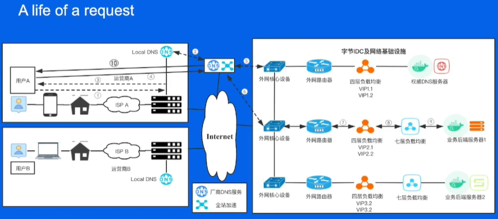

# Network & Deploy
Tiktok: DNS & HTTP(comment API, download pic & vid)

## 网络接入

### Web （physical）
Client (PC, phone) - Web(中国电信 联通 美国网络<光缆>) - Server
last mile: 丢包 卡顿

### 路由Router （logical）
address / 26 (掩码 - 子网范围)
同网段：子网以内 （直连 / 交换机(ip) /SDN （网络虚拟化））
发包:目标ip map

跨局域网
路由(to YYY via XXX, default via ZZZ)
- 不一定是对称的（去和回）
- 工作一般大部分在ip层，也有在传输层的协议
- 路由是改Mac,找到发包口（arp请求？）动态路由由BGP/OSPF等

### ARP协议
- 逻辑同网段才能发送ARP
- ARP请求广播，ARP应答单播
- 生产环境：免费ARP（新增服务器 - 刷新ip、IPv6 - 提前判断ip冲突）？ARP代理？

### IP协议
唯一标识，互联网通用。抖音客户端一个，抖音服务端一个。
- Mac地址不能代替IP地址：mac是二层（以太网）协议，二层还有别的协议，互联网遗留问题，向下兼容（IP封装一遍）
- IPv4不够用： IPv6 / NAT

### NAT
家里路由器
- 通过NAT改原地址，联到外网时用同一个IPv4地址，节约
多个内网客户端访问同一个目标地址+端口，源端口恰好一样，冲突了？
- NAT改IP+端口（自己维护一张表）

## 网络传输
OSI七层网络模型 **TCP/IP四层概念模型**
**应用层**
表示层（obsolete）
会话层（obsolete）
**传输层**
**网络层**
**数据链路层**
物理层
以及其对应网络协议

wireshark抓包

### 先请求DNS
递归解析器（根域/顶级域/权威服务器）=>服务端

### DNS的传输协议UDP
实现简单：分配一个UDP头，把payload里面塞数据发出去就好

用好很难（怎么保证协议可靠？）：发包每次发多少？怎么避免分片？怎么知道没丢包？怎么权衡传输效率和质量？

### TCP三次握手
TCP连接：状态
拔了网线，连接会断吗？有keep-alive 收不到ack会断，不然不会断
tcpdump+wireshark

Seq number:表示我方这边这个packet的数据部分第一位应该在整个data stream中的位置

Ack number:期望对方的下一次seq num是多少

注意：syn/fin的传输虽然没有data，但是会让下一次传输的packet seq加一，但是ack的传输不会加一

TCP的有限状态机
Timewait： 会占用端口 => timewait recycle/reuse 相信可靠 不占端口

丢包：ack的机制

滑动窗口

流量控制/拥塞控制

### HTTP
基于TCP多加了一层规矩，让用户更加清晰、简洁（HTTP军事专用语，TCP中文）

1.1优化：长连接，部分传输，host，缓存

https:加密了，解密出来依然是http（ex.减少传输中被插入小网站）
ssl/tls握手
对称加密（被破解就不能加密了）和非对称加密（公钥和私钥：第三方CA确保没有劫持也确保私钥不泄密）

## 网络提速
HTTP2.0: multiplexing多路并发下载

多路复用/stream： 同一个TCP连接通道 发stream很快 上层看起来是并行

丢包：队头堵塞 ->指定ack 但是没有本质上解决队头堵塞

quic/http3.0

## 网络接入

