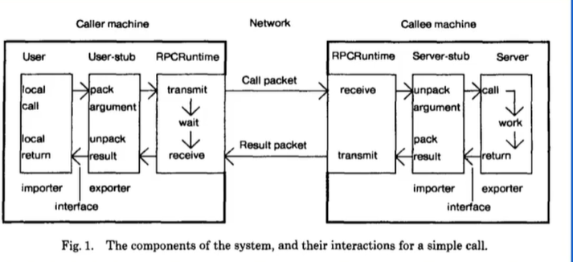
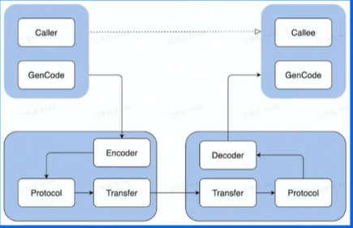
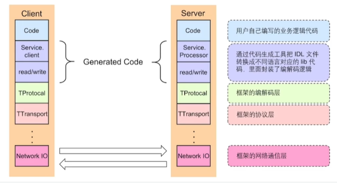
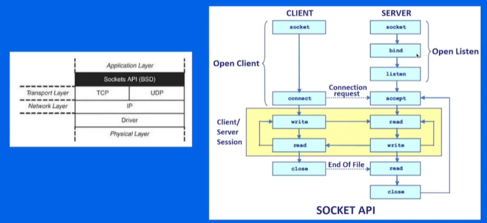
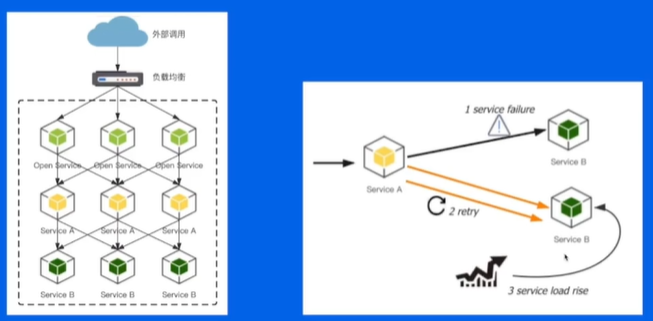
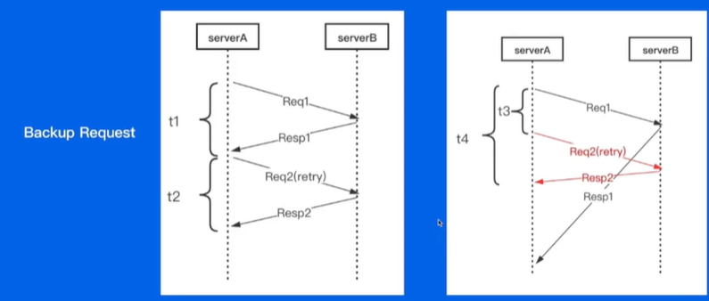
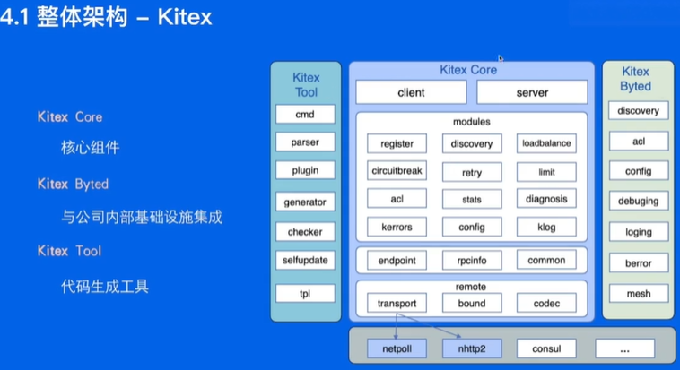
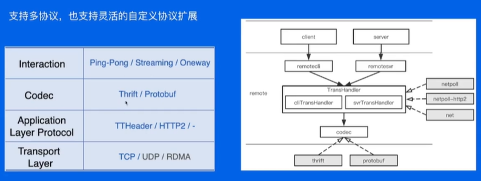
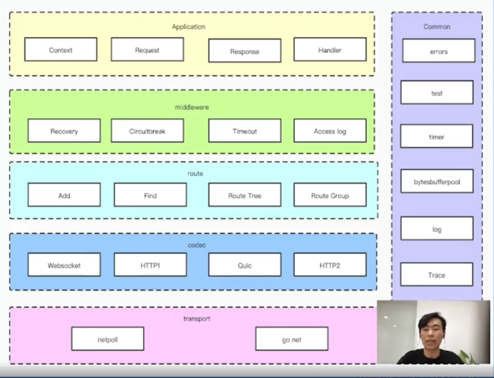

# RPC
RPC: remote procedure calls

Problem:
- 函数映射
- 数据转换成字节流
- 网络传输

Model:

User - User-stub - RPC runtime - Server-stub - Server



IDL:interface description language 中立方式描述借口，使不同平台可以互相通信（ex.不知道对方函数方法）

生成代码: 把IDL转换为对应的静态库

编解码：从内存中表示到字节序列的转换称为解码，反之为解码，也常叫做序列化和反序列化

通信协议：规范了数据在网络中的传输内容和格式，通常还会包含额外元数据

网络传输：TCP/UDP

Pros:
- 单一职责，有利于分工协作和运维开发
- 可扩展性强，资源利用率更优
- 故障隔离，服务整体可靠性更高

需要处理的问题（RPC框架）:
- 服务宕机，对方如何处理
- 网络异常，如何保证信息可达性
- 请求量突增导致服务无法及时处理的应对措施

分层设计 - apache thrift



### 编解码层
数据格式：
- 语言特定格式：java.io
- 文本格式：JSON，XML,CSV，人类可读性高
- **二进制编码**：跨语言高性能，如thrift的BinaryProtocol -> tlv编码：tag length value (type, field tag, length, martin)

选型：兼容性（新增不影响老），通用性（跨平台跨语言），性能（空间时间）

### 协议层
特殊结束符、变长协议（length+content）

-->peek MagicNumber(what protocol)-->peek PayloadCodec(what language)
-->Decode Payload

### 网络通信层
Sockets API

网络库
- 提供易用API：封装底层socket api，连接管理和事件分发
- 功能：协议支持，优雅退出，异常处理
- 性能：应用层buffer减少copy，高性能定时器、对象池

## 关键指标
**稳定性**
保障策略：熔断（保护调用方），限流（保护被调用方），超时控制（避免浪费资源）
请求成功率：负载均衡，重试

长尾请求(request len last 1%, pc99?): backup request

t1+t2>t3+t4 尽量简短判断

**易用性**：开箱即用（参数，文档），周边工具（生成代码工具，脚手架工具<重复>）

**扩展性**
middleware, option, 编解码层，协议层，网络传输层，代码生产工具插件扩展

**观测性**
log, metric, tracing, 内置观测性服务

**高性能**
高吞吐 低延迟


## RPC at Tiktok

自研网络库
背景：
- 原生库无法感知连接状态（影响连接池复用）
- 存在goroutine暴涨的风险（一个连接一个goroutine，连接利用率底下，占用调度）
=》 Netpoll
- epoll
- goroutine池
- 其他：nocopy buffer（编解码层零拷贝）
扩展性: 

编解码优化：
- codegen： 预计算并预分配内存， inline减少函数调用和不必要的反射，自研thriftgo实现thrift idl解析和代码生成器
- JIT(just in time)：改善用户体验，更强编解码性能，减轻用户维护生成代码的负担=>frugal


合并部署
微服务过微，传输和序列化开销越来越大-》将亲和性强的服务实力尽可能和调度到同一个物理机（远处RPC-》本地RPC）


# HTTP
前端： 终端 - 前端路由 - 页面 - 状态管理 - API接口 - HTTP请求

后端： 数据库 - 业务逻辑 - 后端路由 - 请求解析 - HTTP请求

## HTTP protocol
边界： 开始 结束 ||
携带信息：什么消息， 消息类型

Request/Status Line - Header - Body

Request Method: GET/HEAD/POST/PUT(full)/DELETE/CONNECT/OPTIONS/TRACE/PATCH(part)

Process：
```
业务层： client server
服务治理层：service/govermance
中间件层：middleware 
路由层: n/a  route
协议编（解）码层: codec
传输层：transport
```

Disadvantage

HTTP1: 队头阻塞，传输效率低， 明文传输不安全

HTTP2： （improve）多路复用，头部压缩，二进制协议

QUIC：基于UDP（不是TCP）解决队头阻塞，加密减少握手，支持快速启动

## Design and realization

API design: simple, understandable
middleware: onion(common wrap around core)
router: prefix tree
protocol: don't store contexts inside a struct type: pass a Context to each function as the first parameter; to read & write on connection, pass the conn
network: B(blocked)IO/NIO(netpoll)

## Optimization
### Network Package
go net
- store all headers
- less times to use system
- reuse allocation space
- read multiple times
=> go net with bufio(buffer)

**better for streams & small package**

netpoll
- store all headers(2 half linked nodes)
- copy complete body(2 half linked nodes)
netpoll with nocopy peek
- allocation enough buffer(headers together & body together in one buffer instead of nodes)
- limit max buffer size
**better for mid & large package and better latency**

### Protocol
**header**
boundary of header line:\r\n => find \n and check whether there's a \r in front

better: SIMD(single instruction multiple data) ex. sonic

filter using the first char of header key & byte slice (better than byte) to manage corresponding header
- con: no map structure

stadardized header key format
- pro: better efficiency to transform (40x faster than net.http)
- con: extra space & cumbersome to change hashing method

**requestContext pool**
- pro: less allocation, more reusability, less pressure for GC
- cons:extra reset logic, request validity, difficult to locate problems
## Industry


